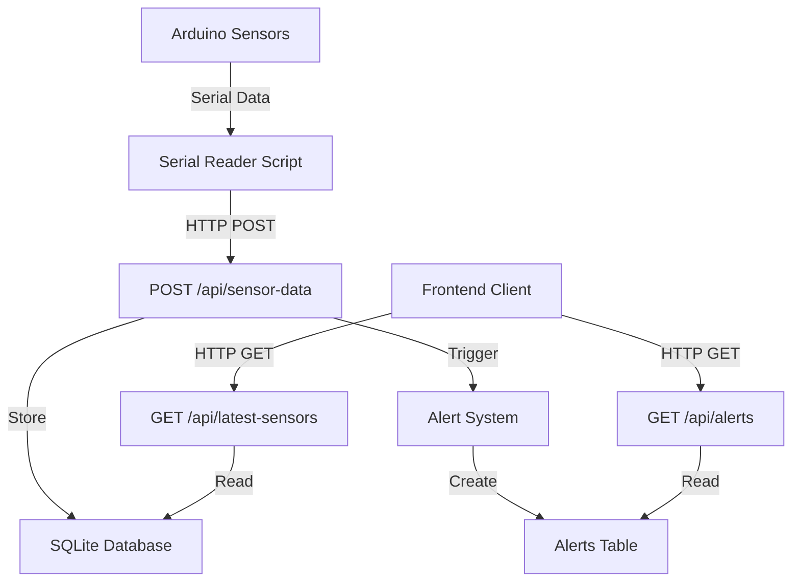

# VeridianOS API Documentation

This directory contains comprehensive documentation for all API endpoints in the VeridianOS server.

## 📋 API Overview

VeridianOS provides a RESTful API for managing plant monitoring data, user accounts, and system settings. All endpoints are prefixed with `/api` and return JSON responses.

## 📚 Documentation Files

### [📊 Sensor Data API](./api-sensor-routes.md)
**File:** `server/src/api/sensor-routes.ts`

Complete documentation for:
- **Sensor Data Management** - Submit and retrieve sensor readings from Arduino/hardware

**Key Endpoints:**
- `POST /api/sensor-data` - Submit sensor readings
- `GET /api/latest-sensors` - Get latest sensor data
- `GET /api/sensor-history/:sensorType` - Get historical sensor data

---

### [🌱 Plant Management API](./api-plant-routes.md)
**File:** `server/src/api/plant-routes.ts`

Complete documentation for:
- **Plant Management** - CRUD operations for plants
- **Plant Stage Management** - Manage growth stages

**Key Endpoints:**
- `GET /api/plants` - Get all plants
- `POST /api/plants` - Create new plant
- `GET /api/plant-stages` - Get growth stages
- `GET /api/plants/:id/sensor-data` - Get plant-specific sensor data

---

### [🔔 Notification & Alert API](./api-notification-routes.md)
**File:** `server/src/api/notification-routes.ts`

Complete documentation for:
- **Alert System** - Monitor and manage environmental alerts
- **Notification System** - Handle notification tray and badges

**Key Endpoints:**
- `GET /api/alerts` - Retrieve active alerts
- `POST /api/alerts/:id/dismiss` - Dismiss alerts
- `GET /api/notifications/tray` - Get notification tray items
- `GET /api/notifications/unread-count` - Get unread count

---

### [👤 User Management API](./api-user-routes.md)
**File:** `server/src/api/user-routes.ts`

Complete documentation for:
- **User Account Management** - CRUD operations for user accounts
- **User Settings System** - Flexible per-user settings with type support

**Key Endpoints:**
- `POST /api/users` - Create new user
- `GET /api/users/:id` - Get user information
- `GET /api/users/:id/settings` - Get user settings
- `PUT /api/users/:id/settings/:key` - Update user setting

---

## 🚀 Quick Start

### Base URL
```
http://localhost:3001/api
```

### Authentication
Currently, the API does not implement authentication middleware. This should be added for production use.

### Content Type
All requests that include a body should use:
```
Content-Type: application/json
```

### Example Request
```bash
# Get latest sensor readings
curl -X GET http://localhost:3001/api/latest-sensors

# Submit sensor data
curl -X POST http://localhost:3001/api/sensor-data \
  -H "Content-Type: application/json" \
  -d '{
    "temperature": 25.3,
    "humidity": 60.1,
    "soil_moisture": 45.2
  }'
```

## 🏗️ Architecture

### Database
- **Type:** SQLite with WAL mode
- **ORM:** None (using better-sqlite3 with prepared statements)
- **Location:** Configurable via `DATABASE_PATH` environment variable

### Error Handling
All endpoints follow a consistent error response format:
```json
{
  "message": "Human-readable error message",
  "error": "Technical error details"  // optional
}
```

### Response Format
- **Success responses:** Return relevant data directly
- **Create operations:** Return created object with 201 status
- **Update operations:** Return success message with 200 status
- **Delete operations:** Return success message with 200 status

## 🔄 Data Flow



## 🔐 Security Considerations

### Current State
- No authentication middleware
- No rate limiting
- No input validation middleware
- Password hashing handled client-side

### Recommended Improvements
1. **Add JWT-based authentication**
2. **Implement rate limiting**
3. **Add input validation middleware**
4. **Add RBAC (Role-Based Access Control)**
5. **Implement proper password hashing server-side**
6. **Add API key authentication for sensor data submission**

## 🧪 Testing

### Manual Testing
Use tools like:
- **cURL** - Command line testing
- **Postman** - GUI-based API testing
- **Insomnia** - Alternative GUI client

### Example Test Commands
```bash
# Test sensor data submission
curl -X POST http://localhost:3001/api/sensor-data \
  -H "Content-Type: application/json" \
  -d '{"temperature": 23.5, "humidity": 55}'

# Test user creation
curl -X POST http://localhost:3001/api/users \
  -H "Content-Type: application/json" \
  -d '{
    "username": "testuser",
    "email": "test@example.com",
    "passwordHash": "hashed-password",
    "fullName": "Test User"
  }'
```

## 📊 Monitoring

### Logging
All endpoints include console logging for:
- Successful operations
- Error conditions
- Database operations

### Health Check
Consider adding a health check endpoint:
```javascript
GET /api/health
// Returns: {"status": "ok", "timestamp": "2025-01-22T10:30:00Z"}
```

## 🔄 Versioning

Currently using semantic versioning through standard-version:
- Current version tracked in `package.json`
- Changelog automatically generated
- Git tags created for each release

## 📈 Future Enhancements

### Planned Features
1. **WebSocket support** for real-time sensor data
2. **Batch sensor data submission**
3. **Data export endpoints**
4. **User avatar upload**
5. **Multi-tenant support**
6. **API documentation auto-generation** (OpenAPI/Swagger)

### Performance Optimizations
1. **Database indexing optimization**
2. **Response caching**
3. **Database connection pooling**
4. **Compression middleware**

---

## 📝 Contributing

When adding new endpoints:
1. Follow the existing patterns in route files
2. Add comprehensive error handling
3. Update the relevant documentation file
4. Include example requests/responses
5. Test all status codes and edge cases

---

**Last Updated:** January 22, 2025  
**API Version:** 0.4.1
